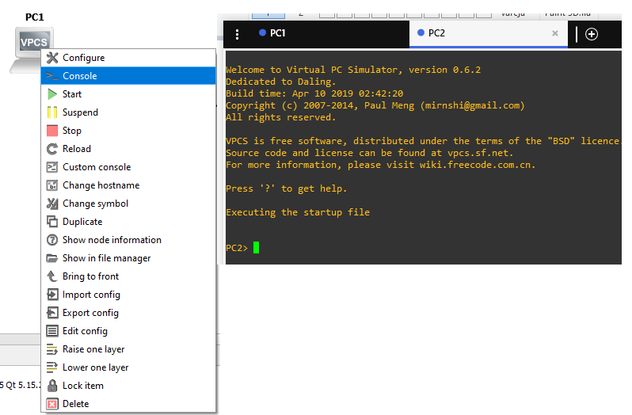
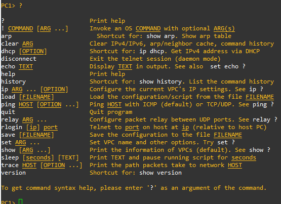
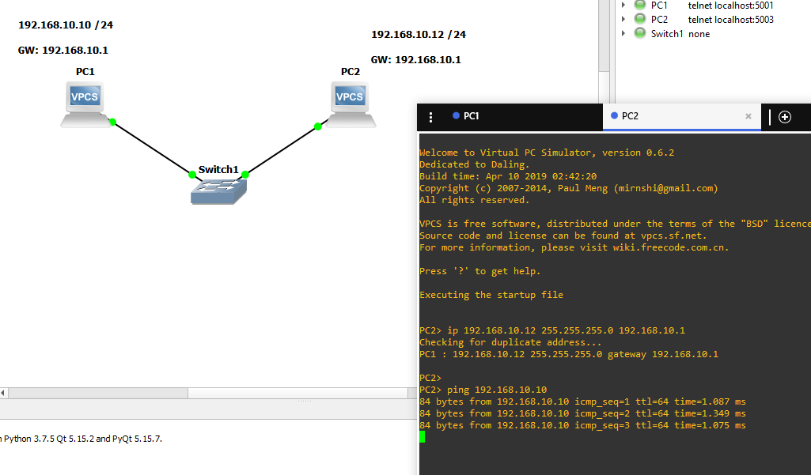
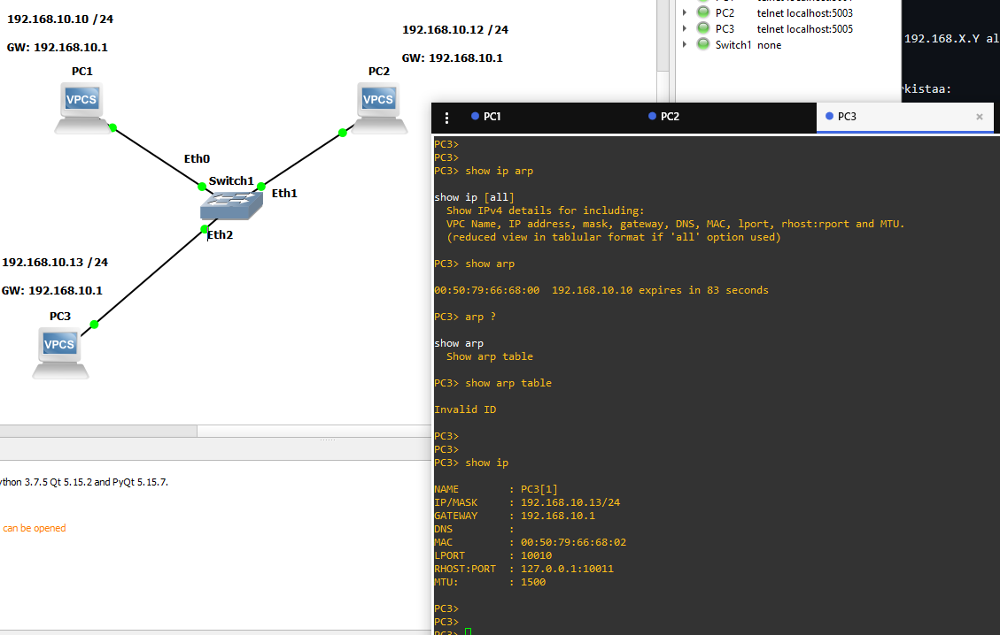

# Pientä kertausta ja simppeli asennus

Perus ensimmäinen GNS3 virtuaalikone ympäristö harjoitus, ennen sitä perus lataus ja latauksesta perus ladataan oletuksena, mutta tarvittaessa voi ladata lisää työkaluja. 

Pieni kertausta ja pieni simppeli kuinka GNS3 asennettaan laiteitta ja konffausta.

* 

HUOM! tämä oli ladattu edellisenä azure pilvestä, eli ekana jouduttiin ladata vm-kone, että miltä se näyttää ja onko miten iso tiedosto

Ensimmäisenä luodaan PC2:lle ip osoite, ei vain mennä kuin cisco ympäristö $ip add [ip-osoite], vaan GNS:llä koneelle console:ssa syötettään $ip 10.1.1.15 255.255.255.0 ja perus testaus pinggataan PC1:stä. Ja PC1 on määritetty IP-osoiteeksi 10.1.1.2 Alt text

## Toinen harjoitus 

Toiseen harjoitukseen lisätään gateway, että katsotaan miten se menee

Perus ekana avaan koneen console, josta ponnahtaa uusi ikkuna (solarwinds) putty/cmd näköinen näkymä.

Jos ei tiedä, mitä ensimmäisenä tehdään niin perus syötettään kysymysmerkki niin katsotaan, mitä kone tarjoaa. Tässä on muutama tuttui komentoja mm. IP, pinggaus, arp-taulukko, clear ja jne.

Ensimmäisenä perus annettaan PC1 ja PC2:lle koneet vaikappa just tämä tuttu 192.168.X.Y alkuinen. Consolesta sitten annettaan koneelle oma ip-osoite.

Vaihtoehtoisia kuinka annettaan koneelle IP-osoite, sekä sinä se skannaa/tarkistaa:

- PC3> ip 192.168.10.13/24 192.168.10.1
Checking for duplicate address...
PC1 : 192.168.10.13 255.255.255.0 gateway 192.168.10.1

- PC2> ip 192.168.10.12 255.255.255.0 192.168.10.1

Sekä kuinka tarkistellaan yksittäisen oma IP-osoite vaikappa PC3:

PC3> show ip

NAME        : PC3[1]
IP/MASK     : 192.168.10.13/24
GATEWAY     : 192.168.10.1
DNS         :
MAC         : 00:50:79:66:68:02
LPORT       : 10010
RHOST:PORT  : 127.0.0.1:10011
MTU:        : 1500

PC3 arp taulukkosta näkee mihin viimeksi se on pinggannut vaikappa esim. PC1:lle:

PC3> show arp

00:50:79:66:68:00  192.168.10.10 expires in 83 seconds

