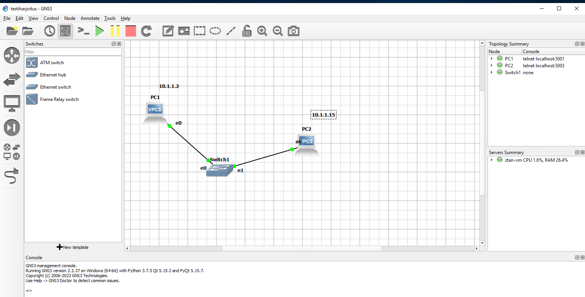
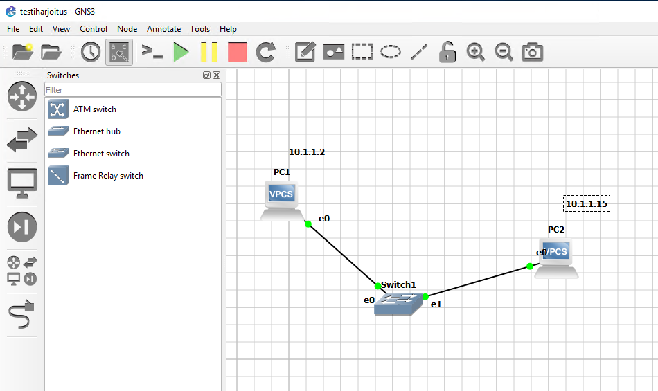
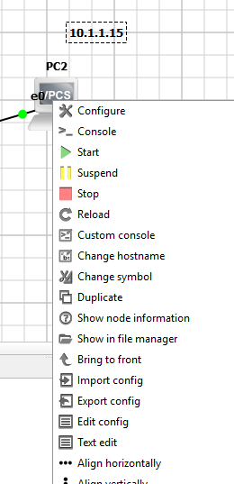
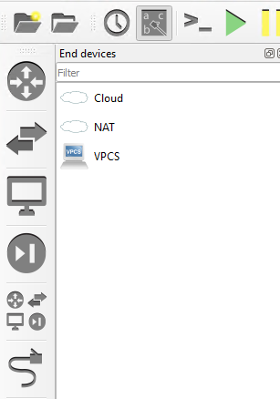
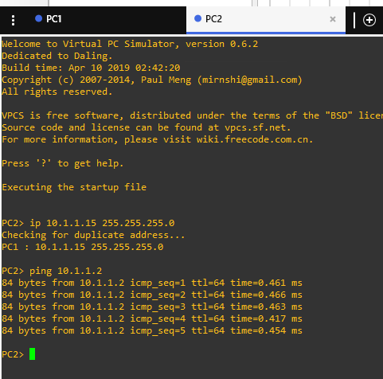

# Pientä kertausta ja simppeli asennus

Perus ensimmäinen GNS3 virtuaalikone ympäristö harjoitus, ennen sitä perus lataus ja latauksesta perus ladataan oletuksena, mutta tarvittaessa voi ladata lisää työkaluja. 

Pieni kertausta ja pieni simppeli kuinka GNS3 asennettaan laiteitta ja konffausta.

* 

Ensimmäisenä luodaan PC2:lle ip osoite, ei vain mennä kuin cisco ympäristö $ip add [ip-osoite], vaan $ip 10.1.1.15 255.255.255.0 ja perus testaus pinggataan PC1:stä. Ja PC1 on määritetty IP-osoiteeksi 10.1.1.2 Alt text

## Perus simppeli konffaus 

Perus simppeli konffaukset eli annettaan koneelle IP-osoite & myös kuinka laitettaan kone käyntiin/pois/reset ja liitettään kytkimeen, että jopa tommoinen putty/cli näkymä.

