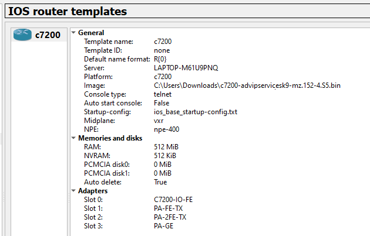

# GNS3 image tuominen

eli tänne tulee kaikki erilaiset steppit, miten saa <b>oikeasti</b> upotettua gns3 simulaatioon noita monipuolisia verkko brändejä harjoitukseen, ei väliä onko kyse jupiter, zyxel, huawei, cisco, hpe aruba ja jne.

* [type 1](#type-1)
* [type 2](#type-2)

## type 1

http://srijit.com/working-cisco-ios-gns3/
https://mega.nz/folder/nJR3BTjJ#N5wZsncqDkdKyFQLELU1wQ
https://www.youtube.com/watch?v=1hoZEscB038

## type 2
