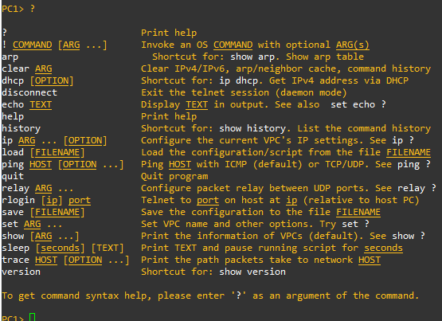
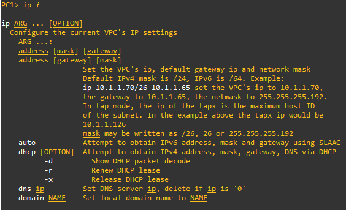

# Cheat sheets

Tänne tulee poikkeukset cheat sheet:it mm. kuinka annettaan koneelle yksittäinen ip-osoite ja vähä kuin suorittaisi console järjestelmän (cmd)

## VPCS / PC

PC koneelle perus syötettään kysymysmerkki niin antaa/toistaa vaihtoehtoisia valintoja, mitä ollaan hakemassa, myös esim. vaikappa koneelle ip-osoite määrits

Pieni listaus taulukko yleis arkipv tarkistaa PC koneen komennot

| Komennot | kuvaus | 
| ------- | ------- |
| $ip [add] [mask] [GW] | tietokoneelle (VPCS) yksittäinen kiinteä ip-osoite esim.   $ip 192.168.10.2 255.255.255.0 192.168.10.1     GW eli gateway, muita esimerkkejä   $ip 192.168.10.13/24 192.168.10.1  |
| $show ip | tarkista yksittäisen konen kiinteä ip-osoite, gw, dns, mac ja jne. esim;    NAME : PC3[1]   IP/MASK : 192.168.10.13/24   GATEWAY : 192.168.10.1   DNS :   MAC : 00:50:79:66:68:02   LPORT : 10010   RHOST:PORT : 127.0.0.1:10011   MTU: : 1500 |
| $show arp | tarkista yksittäisen koneen arp taulukko, mikä periaatteessa tarkoittaa mitä kyseisen koneen kanssa on pinggattu yhteytä vaikappa Kone-A pinggasi Kone-B, C ja jne.    esim;   00:50:79:66:68:00 192.168.10.10 expires in 83 seconds | 
| $save | tarvittaessa kantsii tallentaa määritetty koneelle se ip-osoite, että tietää seuraavan kerran niin ei tarvi tehdä suurta metsästystä paitsi tarkistaa ip-osoite eli $show ip