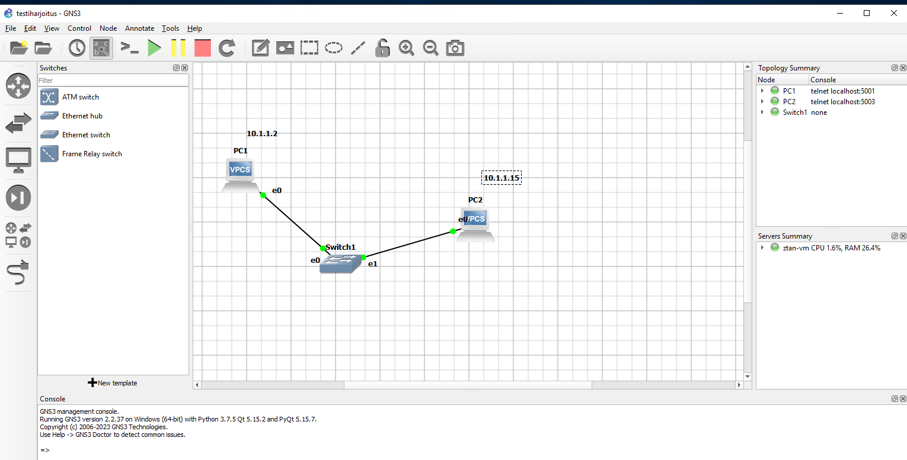
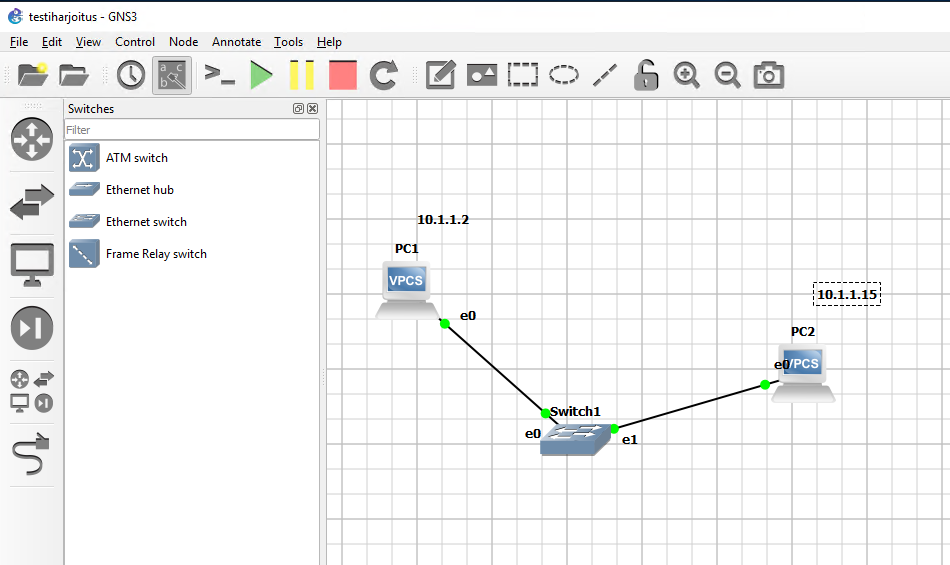
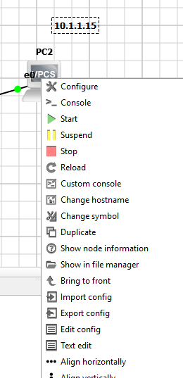
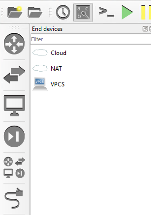
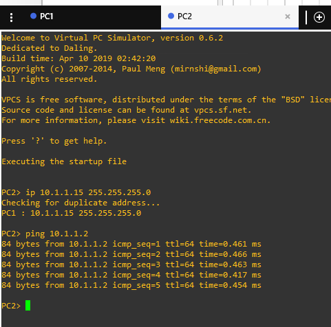

# Eka harjoitus

Perus ensimmäinen GNS3 virtuaalikone ympäristö harjoitus, ennen sitä perus lataus ja latauksesta perus ladataan oletuksena, mutta tarvittaessa voi ladata lisää työkaluja

Ensimmäisenä luodaan PC2:lle ip osoite, ei vain mennä kuin cisco ympäristö $ip add [ip-osoite], vaan $ip 10.1.1.15 255.255.255.0 ja perus testaus pinggataan PC1:stä. Ja PC1 on määritetty IP-osoiteeksi 10.1.1.2

