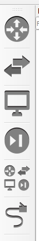

# GNS3

Graphical Network Simulator-3 - verkko ohjelmisto emulaattori, mitä mahdollistaa virtuaalisten ja todellisten laitteiden yhdistelmän, jota käytetään monimutkaisten verkkojen simulointiin. Myös mahdollista tukea palomuuriin tuotteisiin (fortigate), jotta pitää ladata paketti tiedosto simulaation sisään, jotta voi hyöydyntää harjoittelun.

Jos lataa pohjallisen simulaation fyysiselle työasemalleki <b>GNS3 GUI</b> se on ok tai vaihtoehtoisena on simulaation taakse <b> (GNS3 VM)</b> eli oma fyysisen työasemaan pitää ladata/aktiovida virtuaalikone (virtualbox, vmware tai hyper-v). Mutta gns3 sovelluksen näiden virtuaalisointikone se vain tukee kuin server listattuna, mitä laiteitta voi kuin preferenssi (suuntautuminen) tai kuin integroituna molempiin. Myös molemmat ovat suosittuja välineitä.

Jos vmware tyyppistä niin gns3 tukee vmware esxi/workstation and fusion.

* [laitteistot](#laitteistot)
* [Pikaiset käyttöliittymät](#pikaiset-käyttöliittymät)
* [lisä laiteitta](#lisä-laiteitta)
    * [Laiteen lisäys malleja](#laiteen-lisäys-malleja)

- [muita gns ongelmia](#muita-gns-ongelmia)
    * [virtualikone integrointi](#virtualikone-integrointi)

- [gns omia dokumentit ja ohjeita](#gns-omia-dokumentit-ja-ohjeita)
    * [academy](#academy)
    * [muita ohjeita jos puuttuu](#muita-ohjeita-jos-puuttuu)

## laitteistot

Simulaatio tukee Cisco laiteistoja mm. <b>c7200 lateitta</b>, <b>juniper</b>, <b>huawei</b>, <b> fortigate</b>, <b> pfsense</b> ja yms brändi merkisiä laiteistoja. Periaattees voi upottaa simulaation sisään, mitä voisi kokeilla kuin realistisena konffauksena, että testaa ennen kuin hankii fyysen laiteiston esim. koti tai paikallisen toimistoon, koska säästäisi rahaa tosi paljon ja tietää miltä se kuin toimii realistisena. Toiminnaltaa toimii kuin realistinen, mutta pitää päällä yhtäjaksoisesti niin se on negatiivisin puoli eli sähköt.

## Pikaiset käyttöliittymät

Pikainen lyhyt GUI (graphical user interface) graafinen käyttöliittymät

Perus vasemman käyttöliittymmä, josta löytyy useita laiteita mm. reititin/palomuuri, kytkimet, pilvi, nat:taus, tietokone ja jne. Sekä kuinka yhdistää/liittää tietokonen kytkimelle tai muu laiteelle. Jokaisessa näiden 5-nappista (ylhältä laskien) niin löytyy <b>New Template</b>, eli malleja josta tuoo esim. tietoverkkojen brändi tuoteita GNS3 simulaatioon sovellukseen suorittamaan harjoituksen kuin realistisessa elämässä, mutta ongelmana ehkä voi olla jotakin puuttuvia osia että ei mee ihan 100% sama kuin tosi elämässä..

Viimeisenä tommoinen käärme / verkkoliitin näköinen on, että liitettään laite x --> johonkin laite y:hyn.  

 
Routers eli reitittimiä, palomuureja tai yhdistelmä reititin-palomuuri  

 

Kytkimet  

 

 
Erilliset pilvet , nat? 
VPCS - tarkoittaa tietokonetta ei väliä onko läppäri tai fyysinen tietokone (sellainen iso)

  
 

Security devices -  

 

 
Pikainen valikko, että löytyy kaikki laitteet, mitä omistaa tai kuin kokonaisuudesssa projektissa tai koko GNS3 sovelluksessa löytyy. Esim. Cisco packet tracer versio X.Y.Z on oletuksena näitä N kpl laiteitta.  

 

- Viimeisenä jos on jotakin muistiinpanoja tai merkintöjä toi ensimmäinen kynä merkkinen näköinen on se.
- Toisena merkkinä on (insert pics) - jotakin raahaataan työasemalta jokin kuva
- Kolmas-viides on piirtämistä, että rajoitettaan esim. tässä alueella X-jotakin tai ympyrä Y-jotakin ja perus viiva (raja)
- Lukkon näköinen, ikään kuin lukittaisi X laitetta vaikkapa reititin tai kone ettei siihen tehdä muutosta.
- Ihan oikealla perus zoom in & out, ja kamera logoinen (screenshot)

  

## lisä laiteitta

<b>new Template</b> - Periaatteessa tuodaan/haetaan/ladataan/ tai importoidaan uutta laiteistoa GNS3 virtuaali tietoliikenne ympäristöön, että siitä suoritettaan selainen harjoitus ennen fyysistä ja realista tekemistä. 

Jos on puuttuvia laitetitta/malleja niin voi ladata sovelluksen kautta, mutta mikäli jos on olemassa oleva tiedosto niin perus "import" X-tiedosto, ja tulee olemaan .gns3a tiedostotyyppi. GNS3:lla on oma <ins>marketplaces</ins>, josta voi hyvin käydä lataa sen tiedosto kansion niin perus upottaa GNS3 virtuaaliympäristöön. Marketplaces löytyy mm. labs, softwares, trainng, pdocasts ja jne.

Manually - tarkoittaa jotakin preferenssiä, että muita tukevia sovelluksia ja tiettyjä järjestelmiä.
 
  

Perus oletuksena GNS3 virtuaali tietoliikenne verkko ympäristössä on palomuurit, reititin tai yhdistelmä (reititin-palomuuri), erilliset kytkimet ja jne. Guests tarkoittaa erillisiä laiteita mm. iot, selain (firefox), ubuntu, kali linux, macos ja muita ihmeellisiä laiteistoi/vehkeitä.
 
  

Muutama esimerkki laiteitta oletuksena, kun lataa ensimmäisen kerran GNS3:sen sovelluksen pyörimään. Valitse sopiva laite niin sitten vaan "install" ja se lisää laiteen kuin GNS3 käyttöjärjestelmän pohjaan.
 
  

 

  

Erillinen preferenssi/integraatiota, jos työasemaan on ladattu virtualbox/vmware tai käyttöjärjestelmä docker ja jne. Sitten siinä yhdessä valikoimasta on teema muutaminen. Myös kun suorittaa vaikkapa pc, reititin tai kytkimen asetukset muutamista just sitä komento antamista niin se console suoriuttuu kuin realisistinen putty näkymä (kuin identtinen), että perus muokkaa näkymän teeman vähä isommaksi.
  
    

### Laiteen lisäys malleja

Usein mietityttää minkä merkkisen brändin laitteen mallin tai sarjan lataisi simulaatio listalle/laitteeksi, että suorittaa sen harjoituksen. Vaikkapa Cisco joku sarja (C7200) reititintä tai (2960) kytkintä, Huawei reititin ar6121, Juniper kytkin EX3300 ja jne (haettu Googelesta), sekä palomuureja taisi olla yksittäinen merkki kuten Fortigate/fortinet tai pfsense, mutta niissä on vain se versio erona, että tukeeko vanhempi versiosta uuteen.

Oletuksena voisi käyttää GNS3 tarjoavia, että lataa (install) niitä malleja tai vaihtoehtona tuoda ulkopuolisia tietty malli. Sekä vaikuttaa reititimeen, että onks siinä tarjolla sitä 10 Gigabit, 1 Gigabit tai FastbitEthernet porttia, tai jopa Serial porttia. 

Pien kertaus Fast Ethernet (FE) on 100 Mbps & Gigabit Ethernet (GE) on 1000 Mbps ja 10 Gigabit Ethernet 10 000 Mbps.

Linkki GNS3 kuinka tarkistaa Cisco emulaatorin, että mitä reititin ja kytkin tukevat tai <ins> ei tue </ins> GNS3 simulaatio ympäristössä. https://docs.gns3.com/docs/emulators/cisco-ios-images-for-dynamips/

# muita gns ongelmia

Ongelmia voi mahdollista olla, että yrittää saada upotettua lisä laiteistoja GNS3 simulaatio sovellukselle ja sieltä jatkaa eteenpäin, mutta usein jatkuvasti <b>new templates:sta</b> --> siitä kun yritettään "install an appliance from the GNS3 server" niin tuotaa herjaamista. 

Vaihtoehtona se tarvii jopa virtuaalikoneen serverin, jotta saisi pelittämään yhteytä vähä kuin integrointia.

## virtualikone integrointi

GNS3 virtuaalikoneesta vaihtoehtoisia tyyppejä on mm. virtualbox tai vmware ympäristöä, että sisäkkäisen virtualisointituki Intel-suorittimille lisätään, on osoitettava Virtualbox-foorumeille, ei GNS3-käyttäjien foorumeille.

Ennen kuin suoritta mitään niin pitää ladata virtualikoneen oma tarvittava paketti tiedosto, että importaa sen joko <b>vmware:n</b> tai <b>virtualbox</b> koneelle. Koska luodakseen kevyen ja vankan tavan luoda GNS3-topologioita, jotka välttävät useita yleisiä ongelmia, joita esiintyy käytettäessä GNS3:n paikallista asennusta. https://www.gns3.com/software/download-vm 

Tarkista GNS3 käyttöliittymistä kuin Edit -> Preferences ja vasemmasta valikkosta (GNS3 VM) asukset & että sallittaan virtualisointi moottori eli virtualikone ja pidä oletuksena noi tietyt asetukset.

<b> Virtuaalikone vaihde </b> - jos on ladannut virtuaalikoneen työpöytään. Virtualbox sovellus ei ole onneks mikään iso, mutta tarvittavat materiaalit on tosi isoja jopa yli 1GB kapasiteettiä.. 

Virtualkone on päällä nii haettaan (import) ja ladattun GNS3 VM puuttuva osuus.

Tämän jälkeen menee hetki se importtaa sen tiedoston niin jonka jälkeen saa tietyn kuin ip-osoite. Myös kantsii pitää tätä virtuaalikoneen käynnissä, koska mikäli jos tai kun hakee lisää laiteistoja, ja harjoittelee lisä asetuksia mm. leikkii palomuuria, reititystä ja testaa jotakin kuin toimisi tosi elämässä.

Samalla tämä importattu IP-osoite ikäänkuin suorittaisi virtuaalikoneen (server), että voi käydä selailemassa tutkailemassa ja tarkistamassa jänniä asetuksia. Ikäänkuin näyttäisi serverin lokaali sisäiset muistit, perus asetukset (teema) ja jopa löytyy päivitystäkin erikseen.

# gns omia dokumentit ja ohjeita

GNS sovellus tukee työaseman Windows, Mac ja jopa erillinen lataus Linux  
https://docs.gns3.com/docs/   
https://www.gns3.com/software/download   

https://docs.gns3.com/docs/emulators/which-emulators-should-i-use  

GNS3 windows lataus ohje 
https://docs.gns3.com/docs/getting-started/installation/windows   
 

GNS3 Marketplace -> Appliances (template)   
https://www.gns3.com/marketplace/appliances   

## academy

https://gns3.teachable.com/courses

### muita ohjeita jos puuttuu

https://www.youtube.com/watch?v=8VQ8eTmMtjQ  
http://commonerrors.blogspot.com/2019/06/gns3-vm-is-not-available.html  
https://docs.gns3.com/docs/using-gns3/beginners/switching-and-gns3/  

## templates laiteitta 

https://www.raghededris.com/2022/06/06/free-download-cisco-ios-images-for-gns3-and-eve-ng/  