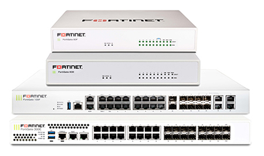
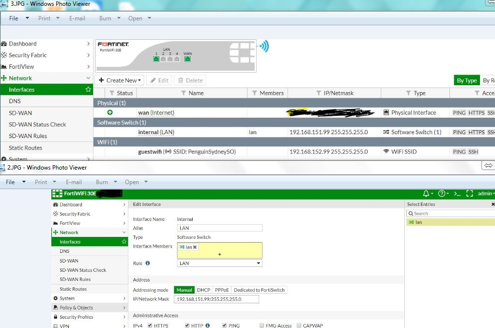

# Fortigate

Fortigate tai Fortinet on sama yksi nimi, mutta tunnetaan parhaiten palomuurin. Palomuuri toimii reitititimenä tai laite itsenä palomuuri laitteena, sen tarkoituksena on suojata oikeetta liikennettä ellei paitsi sallia tietyä liikenteen, suojausta, ja jne.

- [sovellus](#sovellus)
  * [top cli](#top-cli)
  * [Forticloud product family pdf](#Forticloud-product-family-pdf)
  * [demo](#demo)
  * [ohjeistuksia ja yms](#ohjeistuksia-ja-yms)

# sovellus

Sovelluksessa tai määritellyssä tapahtuu lähde- ja kohteen ip-osoiteen määritykset, että sallittaanko/kielettäänkö tai muu käytäntöjen (policy) määritystä mm. joko http/https, protokollan tai muu määritystä.

 

## top cli
tärkeimmät kommenot (tarkista konffaukset ja ip-osoiteet), sekä tulostaa tämän hetkisen ajankohtaisen laitteen asetukset, mitä sisään määritetty asetuksia ja konfiguroitu

- $get system interface physic (get sys int physical) tai ($show sys int)

## Forticloud product family pdf

https://www.fortinet.com/content/dam/fortinet/assets/data-sheets/FortiCloud.pdf

## demo

Fortigate palomuuri demoa löytyy sivustolta:
https://www.fortinet.ca/pages/fortigatedemo 
https://fortigate.fortidemo.com/ (username & password: demo)

## ohjeistuksia ja yms
alku osa, miten lataa fortigate tiedoston forticloud:sta  
https://www.youtube.com/watch?v=SKPrKeKKW4w  
https://www.youtube.com/watch?v=bzDTFAy-Tac  

https://www.youtube.com/watch?v=tKykFpz5fh4  

https://www.hackingarticles.in/firewall-lab-setup-fortigate/  

