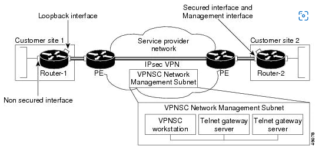
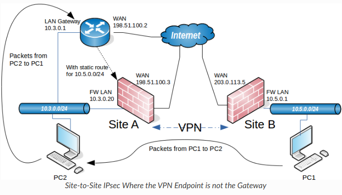
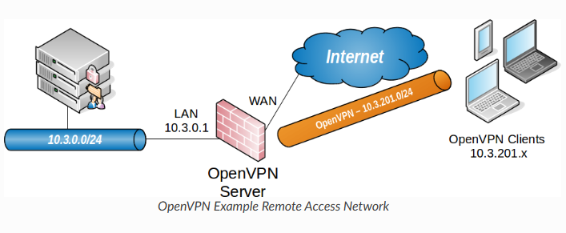

# PFsense

PFsense on reititin-palomuuri jakauma/yhdistelmä laite, joka toimii FreeBSD pohjaisen Unix operaattorijärjestelmällä. Pfsense:llä on kaksi tyyppistä avointa lähde sovellusta <b>Community Edition (CE)</b> ja <b>Plus</b> tyyppinen, että ladattavissa fyysiselle työasemille tai virtuaalikoneeseen omistettun reititin-palomuuri verkkoa laitetta. Se voidaan määrittää ja päivittää web-pohjaisen käyttöliittymän kautta, eikä sen hallinta vaadi taustalla olevan FreeBSD-järjestelmän tuntemusta.

PSense-ohjelmisto on tehokas, joustava palomuuri- ja reititysalusta, että se sisältää pitkän luettelon liittyviä ominaisuuksia. Ohjelmistopakettijärjestelmä mahdollistaa laajennetttavia lisäämättä perusjakelun turvotusta ja mahdollistaa tietoturva-aukkoa. 

  * [Interface in pfsense](#interface-in-pfsense)

- [VPN tyyppit](#vpn-tyyppit)
  * [IPsec](#IPsec)
  * [pfsense ipsec](#pfsense-ipsec)
  * [IKE](#IKE)
  * [ISAKMP Security Association](#isakmp-security-association)
  * [Security Policy](#security-policy)
  * [Phase 1 and 2 settings](#Phase-1-and-2-settings)

- [openvpn](#openvpn)

- [LDAP](#LDAP)
- [ipsec vs openvpn](#ipsec-vs-openvpn)

## Interface in pfsense

- WAN (wide area network) - palomuurin ulkoinenverkko osoite, että jakaa maailmalle ja liitänässä palomuurin yhteyksissä internetiin tai muu upstream verkkoon. 
- LAN (local area network) - palomuurin yksityis osoite, mitä tyyppilisesti käytettään esim. toimisto konttorien sisäistä yksityis osoiteitta käyttäen laiteistoa tukena.
- OPT (optional interfaces refer) - suomeksi valinnais liitäntä viittaa muihin liitäntöihin kuin WAN ja LAN. Se on kuin verkkosegmenti WAN ja LAN - yhteyksille. DMZ - segmenttejä yhteyksiä muihin yksityisiin verkkoihin ja jne.
- DMZ (demilitarized zone) - viittaa suoja-alueen tai kuin sota-alueellisen välisen puskurin. Verkkotoiminnassa se on alue, jossa julkiset palvelimet ovat tavoitettavissa Internetistä WAN-verkon kautta, mutta erillään lähiverkosta. DMZ estää muiden segmenttien järjestelmiä vaarantumasta, jos verkko vaarantuu, samalla kun se suojaa DMZ:n isäntiä muilta paikallisilta segmenteiltä ja Internetiltä yleensä.

# VPN tyyppit

Pfsense ohjelmistossa tarjoaa useita VPN vaihtoehtoisia tyyppejä kuten: <b>IPsec</b>, <b>OpenVPN</b>, <b>wireguard</b> ja <b>L2TP</b>. Tämä osio antaa yleiskatsauksen VPN:n käytöstä, kunkin VPN-tyypi eduista ja haitoista sekä siitä kuinka tulee valita, mikä tulee parhaiten sopia tiettyyn ympäristöön.

L2TP on puhtaasti tunnelointiprotokolla, eikä se tarjoa omaa salausta. Se yhdistetään tyypillisesti toiseen salausmenetelmään, kuten IPsec siirtotilassa. Tästä syystä se ei sovi useimpiin tämän luvun keskusteluihin.

PPTP varoitus! Point-to-Point Tunneling Protocol, on VPN-tunnelointiprotokolla, joka pohjautuu PPP-protokollaan. Se on alun perin tarkoitettu yrityksen ulkopuolella olevien Windows-työasemien kytkeytymisen Windows-palvelimille julkisen verkon ylitse. PPTP-protokolla on PPP-protokollan laajennus joten se voi tunneloida muitakin protokollia kuin TCP/IPtä. Pfsense ohjelmisto ei sisällä PPTP palveilnta, kun PPTP:stä ei saa käyttää missään olosuhteessa, ja koska ei ole enään turvallinen. Myös tämä koskee muita Pfsense ohejlmistoa ja laiteistoja, kun ne eivät ole enää turvallisia.

## IPsec

IP Security Architecture

Tietoliikenneprotokollan Internet-yhteyksien turvaaminen, joka tarjoaa salauksen, osapuolten todennuksen ja tiedon eheyden varmistamisen. Pääasiassa tämä tarkoittaa UDP-pohjaisia sovelluksia, ICMP-kontrolliviestejä sekä reitityksessä ja tunneloinnissa käytettyjä IP-protokollia kuten GRE:tä, OSPF:aa ja niin edelleen. Verrattaessa kuljetuskerroksen protokolliin (4.layer OSI-malli), kuten SSLään, haittapuolena on se, että IPsec-protokollien pitää pystyä hallitsemaan myös vakaus- ja fragmentoitumisongelmat, jotka yleensä on hoidettu korkeammalla tasolla, TCP- eli kuljetuskerroksella.

IPsec-protokollaa voidaan käyttää VPN-ratkaisun eli näennäisen yksityisverkon rakentamiseen kummallakin tavalla. On huomioitava että saavutettava tietoturva eroaa huomattavasti näiden kahden mallin välillä. IPsec pääprotokollat ovat (AH) authentication header ja (ESP) Encapsulation security payload

## pfsense ipsec

Pfsense ipsec tunneli

https://docs.netgate.com/pfsense/en/latest/vpn/ipsec/terms.html

## IKE

## ISAKMP Security Association

## Security Policy

## Phase 1 and 2 settings

# openvpn

Openvpn velhoisuus on pfsense sovelluksen yksi kätevä tapa määrittää etäkäyttö-VPN mobiili asiakkaalle  <b> (remote access) </b>. Ohjattujen konfigurointi/määrityksest kaikki tarvittavat OpenVPN etäkäyttöpalvelimet tarvitsevat edellytyksen:
 - Todennuksen lähteen(source) (paikallinen(local), RAdius-server tai LDAP serverin)
 - Varmentaja (CA = certificate authority)
 - Palvelimen varmenne (A server certificate)
 - OpenVPN palvelinesiintymä (OpenVPN server instance)

Ohjauksen toiminnon lopuss palomuurissa on täysin toimiva palvelin, joka on valmis vastaanottamaan yhteyksiä käyttäjiltä, että tätä palvelinkokooonpanoa voi sitten muuttaa tarpeiden mukaan.

Kun reitittimessäsi on käynnissä VPN-palvelin, nii voi muodostaa yhteyden kotiverkkoon turvallisesti ja päästä käsiksi paikalliseen koneeseen mistä tahansa, ja jopa käyttää koti internetyhteyttä etähallinta laiteella.

# LDAP

Lightweight Directory Access Protocol, on hakemistonpalvelujen tarkoitettu verkkoprotokolla. Se on tarkoitettu tietojen hakemista verko ylitse keskitettyihin palveluihin. Hakemistopalvelu sisältyvät attribuuttipohjaisia/tiedostoattribuutti tietoja, mutta eivät tue monimutkaisiin päivitystoimintoihin kuten transaktio. 

${{\color{red}HUOM}}$; tässä on pien ero LDAP ja microsoft active directory:n kanssa, mitä yhteistä pelivaraa niillä on.

# IPsec vs openvpn

https://blog.miniserver.it/en/pfsense/openvpn-vs-ipsec/